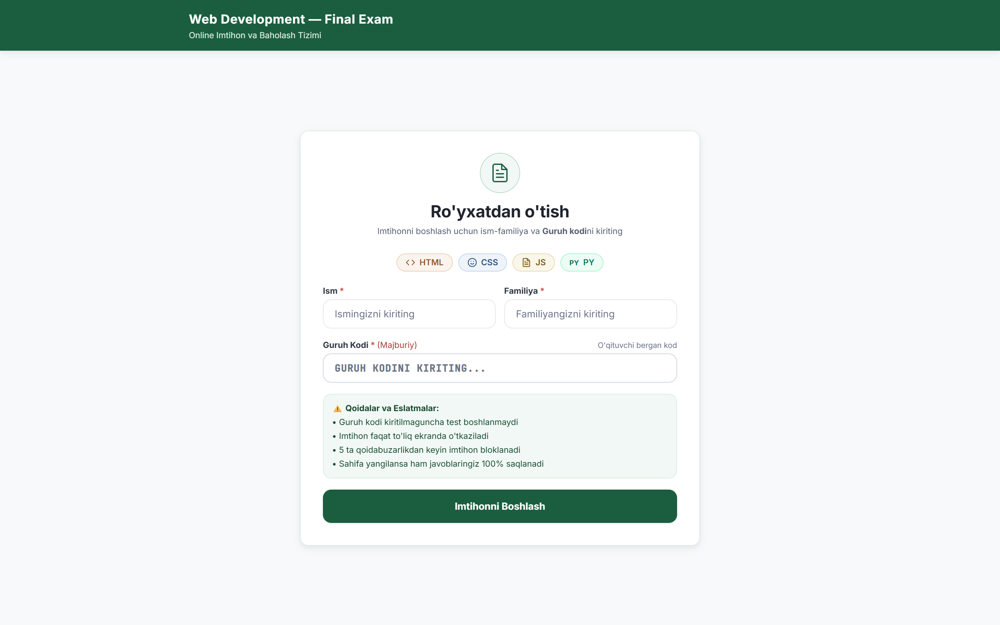
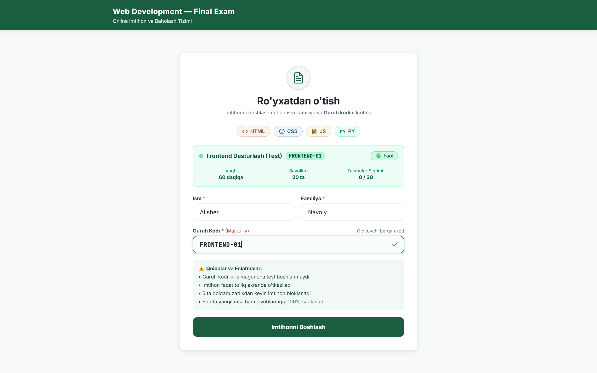
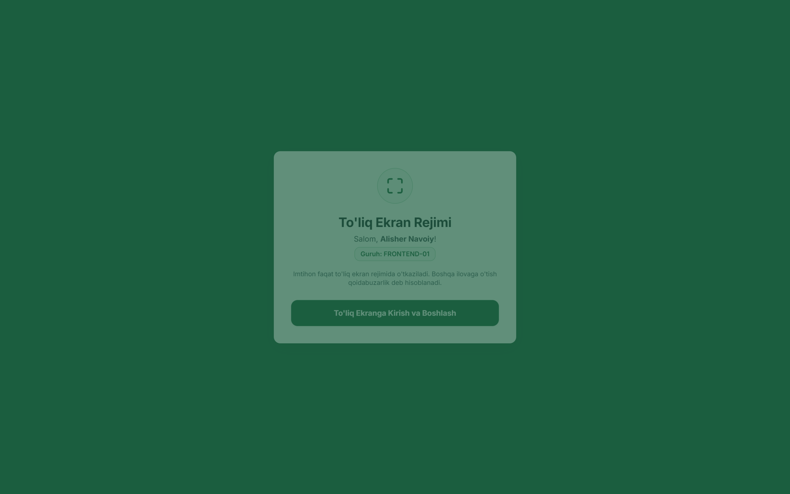
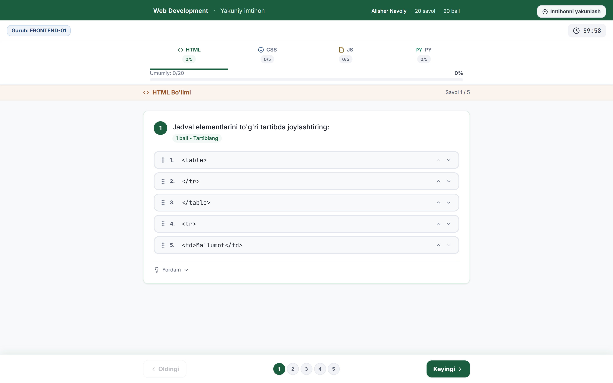
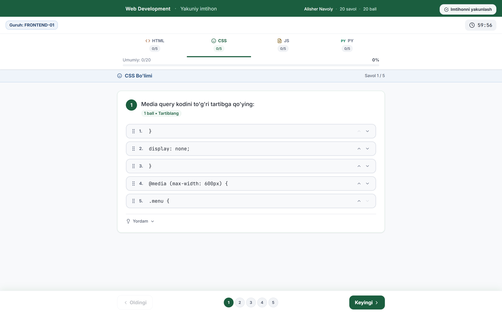
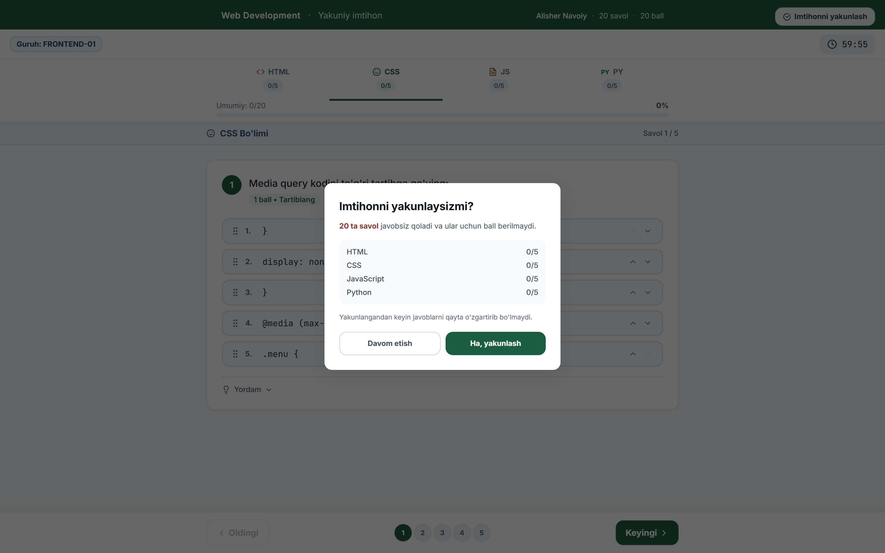
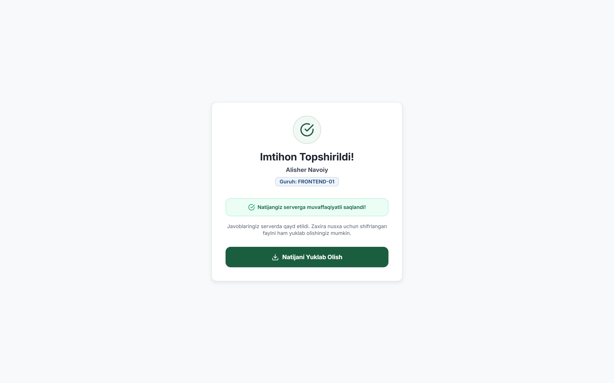
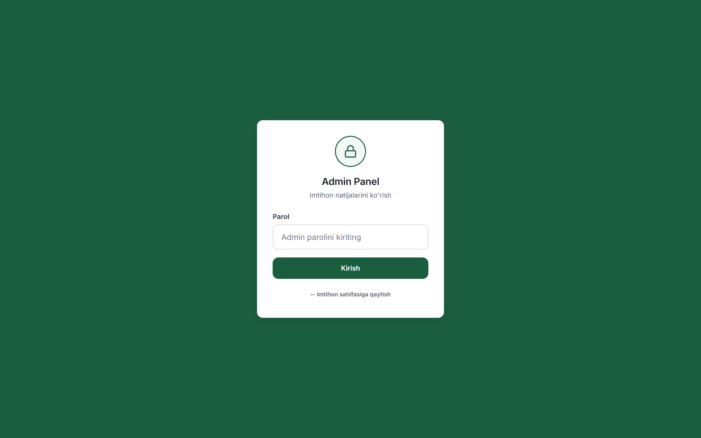
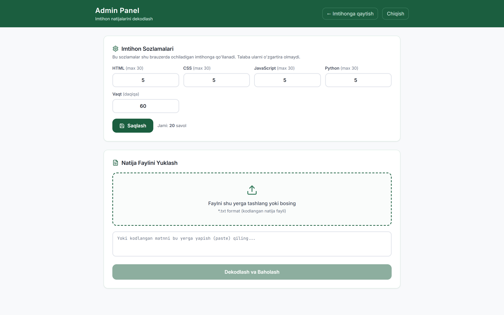

# 📚 MONDAY Imtihon Tizimi — To'liq Foydalanuvchi Qo'llanmasi

Ushbu qo'llanma **MONDAY Test / Imtihon Platformasi**dan foydalanish bo'yicha talabalar, o'qituvchilar va administratorlar uchun bosqichma-bosqich ko'rsatmalarni o'z ichiga oladi. Barcha suratlar tizimning jonli interfeysidan olingan.

---

## 📑 Mundarija
1. [Tizim Haqida](#-tizim-haqida)
2. [1-Qadam: Ro'yxatdan o'tish va Guruhga ulanish](#1-qadam-royxatdan-otish-va-guruhga-ulanish)
3. [2-Qadam: Guruhni tasdiqlash va Imtihon qoidalari](#2-qadam-guruhni-tasdiqlash-va-imtihon-qoidalari)
4. [3-Qadam: To'liq ekran (Fullscreen) rejimiga kirish](#3-qadam-toliq-ekran-fullscreen-rejimiga-kirish)
5. [4-Qadam: Imtihon jarayoni va Savollarni yechish](#4-qadam-imtihon-jarayoni-va-savollarni-yechish)
   - [Bir nechta variantli savollar (MCQ)](#bir-nechta-variantli-savollar-mcq)
   - [Savollar navigatsiyasi va Fanlar bo'yicha o'tish](#savollar-navigatsiyasi-va-fanlar-boyicha-otish)
   - [Turli savol turlari (Kod yozish, Tartiblash)](#turli-savol-turlari-kod-yozish-tartiblash)
6. [5-Qadam: Imtihonni yakunlash va Natijalarni saqlash](#5-qadam-imtihonni-yakunlash-va-natijalarni-saqlash)
7. [6-Qadam: O'qituvchi / Admin Paneli](#6-qadam-oqituvchi--admin-paneli)
   - [Admin paneliga kirish](#admin-paneliga-kirish)
   - [Sozlamalar va Natijalarni dekodlash](#sozlamalar-va-natijalarni-dekodlash)

---

## 🎯 Tizim Haqida

**MONDAY Test Tizimi** — dasturlash va axborot texnologiyalari yo'nalishidagi talabalarning bilimlarini adolatli, xavfsiz va real vaqtda baholash platformasidir.
- **Qo'llab-quvvatlanadigan yo'nalishlar:** HTML, CSS, JavaScript, Python.
- **Anti-Cheat (Firibgarlikdan himoya):** To'liq ekran rejimi, boshqa oynaga/ilovaga o'tishni cheklash, klaviatura yorliqlarini (F11, F12, Alt+Tab, Ctrl+R) bloklash.
- **Avtomatik saqlash:** Internet uzilsa yoki brauzer yangilansa ham, barcha javoblar 100% mahalliy va serverda xavfsiz saqlanadi.

---

## 1-Qadam: Ro'yxatdan o'tish va Guruhga ulanish

Talaba platforma manziliga kirganda qulay va tushunarli ro'yxatdan o'tish oynasi ochiladi:



### Bajariladigan amallar:
1. **Ism**: O'z ismingizni kiriting.
2. **Familiya**: O'z familiyangizni kiriting.
3. **Guruh kodi**: O'qituvchi tomonidan taqdim etilgan maxsus guruh kodini (masalan: `FRONTEND-01`) kiriting.

---

## 2-Qadam: Guruhni tasdiqlash va Imtihon qoidalari

Guruh kodi kiritilishi bilan tizim avtomatik ravishda guruh holatini tekshiradi va jonli ma'lumot kartochkasini chiqaradi:



### Kartochkadagi ma'lumotlar:
- 🟢 **Guruh holati**: Faol / Nofaol.
- ⏱ **Ajratilgan vaqt**: Imtihon uchun belgilangan umumiy vaqt (masalan: *60 daqiqa*).
- 📝 **Savollar soni**: Barcha bo'limlar bo'yicha umumiy savollar miqdori (masalan: *20 ta*).
- 👥 **Talabalar sig'imi**: Guruhdagi maksimal o'rinlar soni.
- Ma'lumotlar to'g'riligiga ishonch hosil qilgach, **"Imtihonni Boshlash"** tugmasini bosing.

---

## 3-Qadam: To'liq ekran (Fullscreen) rejimiga kirish

Adolatli imtihon o'tkazilishini ta'minlash maqsadida tizim to'liq ekran rejimini talab qiladi:



> [!WARNING]
> **Muhim qoida:** Imtihon davomida boshqa oynalarga o'tish yoki to'liq ekrandan chiqish qoidabuzarlik deb baholanadi. 3 ta qoidabuzarlikdan so'ng imtihon avtomatik bloklanadi.

Imtihonni boshlash uchun **"To'liq Ekranga Kirish va Boshlash"** tugmasini bosing.

---

## 4-Qadam: Imtihon jarayoni va Savollarni yechish

### Bir nechta variantli savollar (MCQ)
Imtihon sahifasi yuqori qismida taymer, talaba ma'lumotlari va bo'limlar navigatsiyasi joylashgan:



- **Taymer**: Qolgan vaqtni doimiy ravishda ko'rsatib turadi.
- **Bo'limlar (Kategoriyalar)**: HTML, CSS, JavaScript, Python bo'limlaridagi progress.
- **Yordam (Hint)**: Har bir savol ostidagi yordam tugmasi orqali kerakli eslatmalarni ko'rish mumkin.

### Javobni belgilash
Variantlardan birini tanlaganingizda u yashil hoshiya bilan faollashadi:


### Savollar navigatsiyasi va Fanlar bo'yicha o'tish
Pastki navigatsiya panelidagi raqamlar yoki **"Oldingi" / "Keyingi"** tugmalari orqali istalgan savolga tezkor o'tish mumkin:



---

## 5-Qadam: Imtihonni yakunlash va Natijalarni saqlash

Barcha savollarga javob berilgach yoki vaqt tugashidan oldin yuqoridagi **"Imtihonni yakunlash"** tugmasini bosing. Tizim tasdiqlash oynasini ko'rsatadi:



- Modaldan qaysi bo'limdan nechtadan savolga javob berilgani va nechtasi qolib ketgani ko'rinadi.
- **"Ha, yakunlash"** tugmasi bosilganda natijalar serverga yuboriladi.

### Natija sahifasi:
Natijalar muvaffaqiyatli saqlangach, talabaga tasdiqlov xabari va zaxira nusxa faylini yuklab olish imkoniyati taqdim etiladi:



---

## 6-Qadam: O'qituvchi / Admin Paneli

### Admin paneliga kirish
O'qituvchi va administratorlar uchun maxsus boshqaruv paneli mavjud:
- **Klaviatura yorlig'i**: `Ctrl + Shift + U` yoki `Ctrl + Shift + A`
- **URL orqali**: Brauzer manziliga `#admin` qo'shib kirish mumkin.



- **Standart parol**: `JAMSHID`

### Sozlamalar va Natijalarni dekodlash

Admin panelida o'qituvchilar test parametrlarini o'zgartirishi va topshirilgan natija fayllarini dekodlab baholashi mumkin:



1. **Imtihon Sozlamalari**: Har bir fan bo'yicha savollar soni va umumiy ajratilgan vaqtni belgilash.
2. **Natija Faylini Yuklash / Dekodlash**: Talaba tomonidan topshirilgan shifrlangan `*.txt` natija faylini yuklab, uning to'liq ball va javoblar tahlilini olish.

---

## 🚀 Loyihani Ishga Tushirish (Dasturchilar uchun)

```bash
# 1. Bog'liqliklarni o'rnatish
npm install

# 2. Ishchi rejimda ishga tushirish (Dev Server)
npm run dev

# 3. TypeScript tekshiruvi
npx tsc --noEmit

# 4. Loyihani build qilish (Production)
npm run build
```

---
*© 2026 MONDAY Test Platformasi. Barcha huquqlar himoyalangan.*
